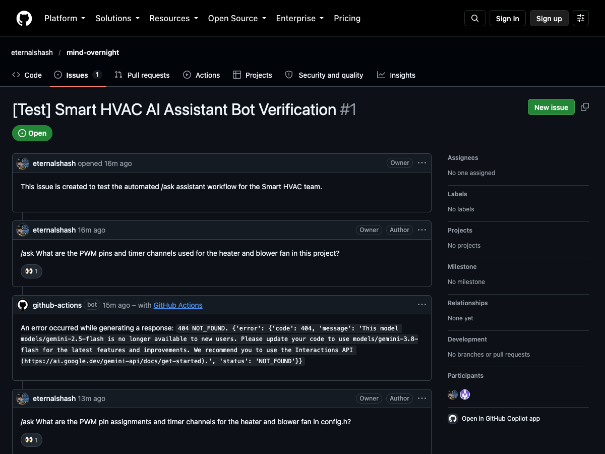
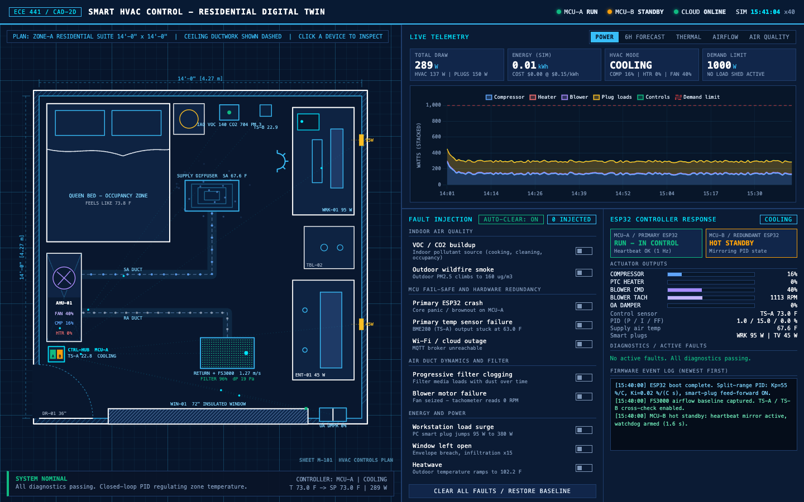
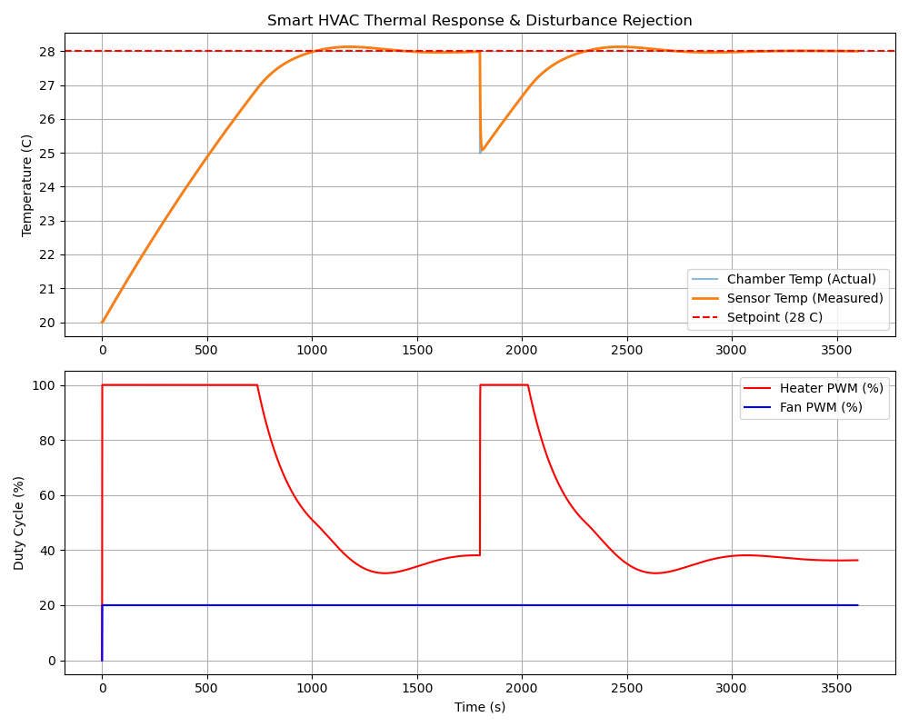
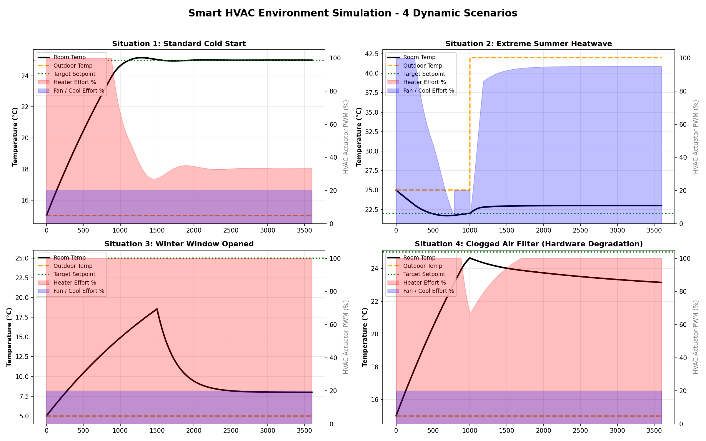

# Team Contribution Guide - Smart HVAC Control

Welcome to the **Smart HVAC Control** project for ECE 441 (Smart and Connected Systems). To keep our codebase clean, prevent merge conflicts, and ensure seamless integration across embedded firmware, simulation modeling, and cloud telemetry, all team members follow this unified contribution guide and standard **Pull Request (PR)** workflow.

Please follow these steps to install the required dependencies, set up the Wokwi hardware simulation environment in VS Code, and submit your contributions.

---

## 1. System Requirements and Programming Languages

Ensure the following core programming languages, runtimes, and build tools are installed on your machine before setting up the project:

| Language / Runtime | Minimum Version | Primary Function in Project | Verification Command |
| :--- | :--- | :--- | :--- |
| **C / C++** | C++11 / C++17 | ESP32 embedded firmware, FreeRTOS tasks, hardware drivers | `gcc --version` or `clang --version` |
| **Python** | 3.9+ (3.10–3.12 recommended) | Analytical thermal simulations, automated testing, IoT scripts | `python3 --version` |
| **Node.js & npm** | Node v18+ LTS / npm v9+ | Headless simulation testing with Puppeteer, web assets | `node -v && npm -v` |
| **Git** | 2.30+ | Distributed version control and branch management | `git --version` |

---

## 2. Required Software Libraries and Dependencies

The project is structured into three integrated subsystems: embedded firmware, numerical physical simulations, and the browser-based digital twin.

### A. ESP32 Firmware Libraries (PlatformIO)

The firmware builds using the PlatformIO ecosystem on top of the Arduino framework for ESP32. All library dependencies are automatically tracked in [`platformio.ini`](platformio.ini):

* **Platform:** `espressif32`
* **Framework:** `arduino`
* **Target Board:** `esp32dev` (ESP32-WROOM-32 / DevKit v4)
* **Libraries:**
  * **`knolleary/PubSubClient`** (`^2.8`): Lightweight MQTT client for telemetry reporting and remote setpoint adjustment over HiveMQ.
  * **`adafruit/Adafruit BME280 Library`** (`^2.2.4`): I2C driver for ambient temperature, relative humidity, and barometric pressure.
  * **`adafruit/Adafruit Unified Sensor`** (`^1.1.14`): Unified sensor abstraction layer required by Adafruit drivers.
  * **`adafruit/Adafruit BusIO`** (`^1.16.1`): Hardware abstraction for I2C and SPI buses.
  * **`br3ttb/PID`** (`^1.2.1`): Continuous closed-loop PID control loop for heater and blower fan modulation.
  * **FreeRTOS (`freertos/task.h`)**: Native dual-core scheduling built into the ESP-IDF core (Core 1 executes deterministic PID control; Core 0 handles Wi-Fi and MQTT telemetry).

To install or restore firmware dependencies via the PlatformIO CLI:
```bash
pio pkg install
```

### B. Python Analytical Simulation Libraries

The numerical models in [`simulation/advanced_env_sim.py`](simulation/advanced_env_sim.py) and [`simulation/thermal_sim.py`](simulation/thermal_sim.py) evaluate envelope heat transfer, indoor air quality (IAQ), and transient PID tuning.

Install the Python libraries via `pip`:
```bash
python3 -m pip install numpy matplotlib
```

* **`numpy`**: Solves discretized differential equations for room thermal mass, envelope heat loss, and IAQ contaminant decay.
* **`matplotlib`**: Generates high-resolution response curves and multi-variable scenario graphs.

### C. Digital Twin Simulation and Headless Verification (Node.js)

The interactive digital twin is located in [`simulation`](simulation).

* **`Chart.js`** (`v4.4.x`): Embedded via CDN for real-time telemetry rendering across five dashboard tabs.
* **`puppeteer`** (`^25.12.0`): Headless Chrome automation for verifying simulation canvas rendering and telemetry logs without a manual browser session.

To install headless testing dependencies:
```bash
cd simulation
npm install
```

---

## 3. Wokwi Simulation Setup in VS Code

Wokwi simulates the ESP32 microcontroller, I2C sensor inputs, analog potentiometers, and PWM actuator circuits directly inside Visual Studio Code. This allows developing and verifying the firmware without physical hardware.

### A. Required VS Code Extensions

Install the following extensions from the Visual Studio Marketplace:

1. **[PlatformIO IDE](https://marketplace.visualstudio.com/items?itemName=platformio.platformio-ide)** (`platformio.platformio-ide`): Compiles the embedded firmware, downloads toolchains, and generates build binaries.
2. **[Wokwi Simulator](https://marketplace.visualstudio.com/items?itemName=Wokwi.wokwi-vscode)** (`Wokwi.wokwi-vscode`): Runs hardware simulation inside the VS Code editor window.
3. **[C/C++](https://marketplace.visualstudio.com/items?itemName=ms-vscode.cpptools)** (`ms-vscode.cpptools`): Provides code navigation, autocomplete, and IntelliSense for Arduino/ESP32 C++.
4. **[Python](https://marketplace.visualstudio.com/items?itemName=ms-python.python)** (`ms-python.python`): Language support for running thermal simulation scripts.

### B. Wokwi License Activation

Wokwi for VS Code requires an active license key or a free trial token:

1. In VS Code, open the Command Palette (`Cmd+Shift+P` on macOS, `Ctrl+Shift+P` on Windows/Linux).
2. Type and run: `Wokwi: Request a Free Trial` (or `Wokwi: Start Simulator`).
3. If prompted, follow the link to the [Wokwi License Portal](https://wokwi.com/dashboard/licenses) to sign in and obtain your personal token.
4. Paste the token into the VS Code prompt when requested. VS Code will confirm: `Wokwi license activated`.

### C. Configuration Files

The repository includes the configuration files pre-configured for the project:

* **[`wokwi.toml`](wokwi.toml)**: Instructs Wokwi where to locate the compiled ELF binary and firmware images:
  ```toml
  [wokwi]
  version = 1
  elf = ".pio/build/esp32dev/firmware.elf"
  firmware = ".pio/build/esp32dev/firmware.bin"
  ```

* **[`diagram.json`](diagram.json)**: Declares simulated virtual components and breadboard wiring:
  * **ESP32 DevKit C v4** (`esp`)
  * **Potentiometer** (`pot1`): Analog temperature input connected to GPIO 34 (ADC1_CH6).
  * **Red LED** (`led_heater`): Visual indicator for heater PWM output connected to GPIO 25 through a 330 ohm current-limiting resistor (`r_heater`).
  * **Blue LED** (`led_fan`): Visual indicator for blower fan PWM output connected to GPIO 26 through a 330 ohm current-limiting resistor (`r_fan`).
  * **Simulated Wi-Fi Gateway**: Automatically associates with virtual network SSID `Wokwi-GUEST` (open network, no password) to reach public MQTT brokers.

### D. Step-by-Step Build and Simulation Instructions

1. **Open the Project Folder in VS Code:**
   Open the directory `code/ECE441/SmartHVAC_Sim` as your workspace root in VS Code.

2. **Compile the Firmware:**
   * Click the **PlatformIO Build** icon (checkmark icon) in the bottom blue status bar, or
   * Run the terminal command:
     ```bash
     pio run
     ```
   * Confirm that compilation succeeds and `.pio/build/esp32dev/firmware.bin` is generated.

3. **Launch the Wokwi Simulation:**
   * Open [`diagram.json`](diagram.json) in the VS Code editor.
   * Click the blue/green **Start Simulation** button above the editor, or
   * Press `Cmd+Shift+P` (macOS) / `Ctrl+Shift+P` (Windows/Linux) and run `Wokwi: Start Simulator`.

4. **Interact with the Virtual Circuit:**
   * **Simulate Temperature Changes:** Rotate the knob on the simulated potentiometer (`pot1`). The firmware reads the analog voltage on GPIO 34 and translates it to a temperature reading between 10.0°C and 40.0°C.
   * **Observe PID Modulation:** 
     * When temperature drops below the setpoint (default 25.0°C), watch the red LED (`led_heater`) brighten as PWM duty cycle increases.
     * When temperature exceeds the setpoint, watch the heater turn off and the blue LED (`led_fan`) modulate higher to circulate air.
   * **Inspect Serial Logs:** Open the Wokwi Serial Monitor tab (115200 baud) to monitor live temperature readings, error calculations, actuator duty cycles, Wi-Fi status, and MQTT telemetry packets.
   * **Verify Cloud Telemetry:** Observe successful MQTT connection logs to `broker.hivemq.com:1883` under topic `ece441/group2/hvac/telemetry`.

---

## 4. Git Collaboration and Pull Request Workflow

We maintain a strict branch and PR workflow. Direct pushes to `main` and `develop` are prohibited.

### Step 1: Clone and Synchronize the Repository

Clone the repository if you have not already done so:
```bash
git clone https://github.com/eternalshash/mind-overnight.git
cd mind-overnight
```

Before beginning any task, ensure your local working environment is updated from the integration branch:
```bash
git checkout develop
git pull origin develop
```

### Step 2: Create a Feature Branch

Always create a new branch from `develop`. Use descriptive names matching your name and feature scope:
```bash
git checkout -b your-name/feature-name

# Examples:
# git checkout -b andy/power-distribution
# git checkout -b shashwat/pid-tuning
# git checkout -b haron/mqtt-telemetry
# git checkout -b kaleb/duct-chamber-tests
```

### Step 3: Implement, Test, and Commit Changes

Write clean, modular code. Test your implementation using the Wokwi simulator, PlatformIO build checks, or simulation scripts before committing.

Stage and commit your changes with clear, descriptive commit messages:
```bash
git add .
git commit -m "feat(firmware): implement anti-windup clamping for PID heater output"
```

### Step 4: Push the Branch to GitHub

Push your feature branch to the remote repository:
```bash
git push -u origin your-name/feature-name
```

### Step 5: Submit a Pull Request (PR)

1. Navigate to the [GitHub Repository](https://github.com/eternalshash/mind-overnight).
2. Click the **Compare & pull request** button next to your recently pushed branch.
3. **CRITICAL:** Set the **base** branch dropdown to **`develop`** (do not merge directly into `main`).
4. Set the **compare** branch to `your-name/feature-name`.
5. Provide a summary of changes, listing:
   * What subsystem was modified (Firmware, Hardware, Simulation, Documentation).
   * Verification steps executed (e.g., Wokwi simulation verified, PlatformIO build clean, Python script executed).
6. Click **Create pull request**.

### Step 6: Review, Validation, and Merge

* Pull Requests will be reviewed for build stability, pin assignments, and coding standards.
* Once approved and verified, your changes will be merged into `develop`.
* Stable releases from `develop` will undergo final integration testing before being merged into `main` for project milestones.

### Step 7: Troubleshooting Git Push Errors (403 Forbidden)

If your `git push` command fails with a **`403 Forbidden`** or **`Authentication failed`** error, your commits **did not** upload to GitHub. This means any Pull Request you open on the website will be empty or tracking the wrong branch.

GitHub removed password authentication in August 2021. You **must** use a Personal Access Token (PAT) as your password.

**How to fix a 403 error (macOS):**
1. **Clear your broken cached password:**
   ```bash
   printf "protocol=https\nhost=github.com\n" | git credential-osxkeychain erase
   ```
2. **Retry your push:**
   ```bash
   git push --set-upstream origin your-name/feature-name
   ```
3. **Authenticate:** When prompted for your username, type your GitHub username. When prompted for your password, **paste your Personal Access Token (PAT)**.

**How to fix a 403 error (Windows):**
1. **Clear your broken cached password:**
   * Open the Start Menu and search for **Credential Manager**.
   * Click **Windows Credentials**.
   * Scroll down to "Generic Credentials", find the entry for `git:https://github.com`, and click **Remove**.
2. **Retry your push:**
   ```bash
   git push --set-upstream origin your-name/feature-name
   ```
3. **Authenticate:** A Windows security pop-up or GitHub login window will appear. If asked to use a browser, do so. If asked for a password in the terminal, **paste your Personal Access Token (PAT)**.

*(To generate a PAT, go to GitHub.com > Settings > Developer Settings > Personal access tokens > Tokens (classic) > Generate new token, and check the `repo` scope).*

### Step 8: Asking Technical Questions via GitHub (`/ask`)

The repository includes an automated technical assistant powered by **Gemini 3.8 Flash** running in GitHub Actions. Any team member can query the assistant directly on any GitHub Issue or Pull Request discussion thread.

#### How to Use It:
1. Open an existing Pull Request, Issue, or create a new Issue on GitHub.
2. In the comment box, type `/ask` followed immediately by your question.
3. Submit the comment.

#### Example Queries:
* **Hardware & Wiring (Andy):**
  ```text
  /ask What are the PWM pin assignments, timer channels, and frequency used for the heater and blower fan?
  ```
* **Firmware & Control (Shashwat):**
  ```text
  /ask How does the discrete PID loop calculate duty cycle in src/main.cpp and how are the Kp, Ki, Kd gains initialized?
  ```
* **Cloud & Networking (Haron):**
  ```text
  /ask What MQTT broker, port, and publish/subscribe topics are configured in config.h?
  ```
* **Aerodynamics & Testing (Kaleb):**
  ```text
  /ask How is the FS3000 airflow velocity mock calculated in hal_sensors.h based on the fan PWM input?
  ```

#### What Happens Under the Hood:
* **Immediate Acknowledgment:** The bot instantly reacts to your comment with eyes to confirm the request was received.
* **Full Codebase Context:** The bot automatically checks out your branch and loads all key system files into memory:
  * Hardware definitions and MQTT topics: [`include/config.h`](include/config.h)
  * Sensor abstractions and mock formulas: [`include/hal_sensors.h`](include/hal_sensors.h)
  * Thermal comfort equations: [`include/thermal_comfort.h`](include/thermal_comfort.h)
  * FreeRTOS tasks and PID loop: [`src/main.cpp`](src/main.cpp)
  * PlatformIO build configuration: [`platformio.ini`](platformio.ini)
  * Wokwi virtual breadboard wiring: [`diagram.json`](diagram.json) and [`wokwi.toml`](wokwi.toml)
  * Analytical physical models: [`simulation/advanced_env_sim.py`](simulation/advanced_env_sim.py)
* **Direct Answer:** Within 30 to 45 seconds, the bot posts a structured technical response with exact code references and wiring tables directly into the comment thread.
* **Live Reference:** See a working demonstration on [GitHub Issue #1](https://github.com/eternalshash/mind-overnight/issues/1#issuecomment-6082902126).

#### Visual Walkthrough:

Posting the `/ask` command on an Issue or PR:


Automated technical response generated with pinout tables and code excerpts:


Full conversation overview:


### Step 9: Automated Engineering Technical Log

To satisfy course requirements emphasizing technical depth and engineering accountability, every push affecting the Smart HVAC subsystem automatically updates our centralized technical log:

* **File Location:** [`TECHNICAL_LOG.md`](TECHNICAL_LOG.md)
* **Automated Workflow:**
  * When any team member pushes a commit or merges a PR affecting `code/ECE441/SmartHVAC_Sim/`, GitHub Actions triggers automatically.
  * The runner inspects the git diff, extracts the author's name, and summarizes the update into a 1 to 2 sentence engineering summary highlighting specific pinouts, control math, or circuit changes.
  * The entry is prepended to `TECHNICAL_LOG.md` without requiring any manual documentation from the author.
* **Historical Backfill:** The entire commit history from project initiation through the digital twin buildouts has been backfilled into `TECHNICAL_LOG.md`.

---

## 5. Visual Documentation and System Media

The following references illustrate system operation across hardware, simulation, and telemetry pipelines:

### Digital Twin Blueprint Simulation
The interactive 2D digital twin visualizes airflow, envelope heat loss, pollutant dispersion, and dual-MCU failover:



*Live Interactive Digital Twin:* [Run Simulation in Browser](https://eternalshash.github.io/mind-overnight/code/ECE441/SmartHVAC_Sim/simulation/index.html)

### PID Transient Thermal Response
Closed-loop step response validation showing heater PWM duty cycle adjustment and chamber temperature stabilization:



### Multi-Scenario Environmental Stress Testing
Simulation curves evaluating sensor drift, extreme outdoor heatwaves, and fan motor degradation:



---

## 6. Important Project Links and Resources

* **GitHub Repository:** [eternalshash/mind-overnight](https://github.com/eternalshash/mind-overnight)
* **Live Digital Twin Simulation:** [Smart HVAC CAD Interface](https://eternalshash.github.io/mind-overnight/code/ECE441/SmartHVAC_Sim/simulation/index.html)
* **Wokwi VS Code Extension:** [Visual Studio Marketplace - Wokwi](https://marketplace.visualstudio.com/items?itemName=Wokwi.wokwi-vscode)
* **Wokwi ESP32 Guide:** [Wokwi ESP32 Documentation](https://docs.wokwi.com/guides/esp32)
* **PlatformIO Documentation:** [PlatformIO Core & IDE](https://docs.platformio.org/)
* **PubSubClient Library:** [knolleary/pubsubclient](https://pubsubclient.knolleary.net/)
* **Adafruit BME280 Driver:** [Adafruit BME280 Library](https://github.com/adafruit/Adafruit_BME280_Library)
* **Arduino PID Controller:** [Arduino-PID-Library by Brett Beauregard](https://github.com/br3ttb/Arduino-PID-Library)
* **Public MQTT WebSocket Client:** [HiveMQ Web Client](http://www.hivemq.com/demos/websocket-client/)
