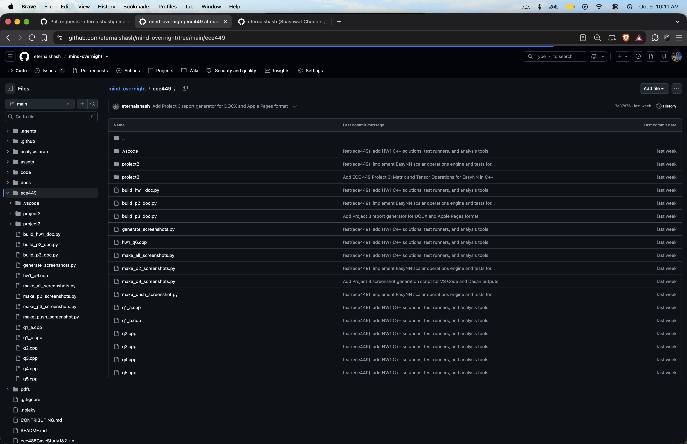

# Smart HVAC Control - Engineering Technical Log

This technical log is automatically maintained to record engineering implementations, hardware pinout configurations, closed-loop control algorithms, physical thermodynamic simulations, and cloud telemetry updates across all team members.

---

### [2026-10-09] Shashwat Choudhry
* **Commit:** `79b696c`
* **Technical Summary:** Updates the project contribution guide with troubleshooting procedures for resolving Git HTTP 403 authentication failures on Windows. The added instructions outline how to purge cached repository credentials from Windows Credential Manager and re-authenticate using GitHub Personal Access Tokens.

---

### [2026-10-09] Shashwat Choudhry
* **Commit:** `4201484`
* **Technical Summary:** Docs: add PR troubleshooting guide for 403 PAT authentication errors. Modified files in the Smart HVAC subsystem.

---

### [2026-10-09] Shashwat Choudhry
* **Commit:** `45feacb`
* **Technical Summary:** Updated the Wokwi simulation documentation asset (`wokwi_leds.png`) to depict the active VS Code simulation window showing LED runtime states. This update affects only visual documentation and introduces no modifications to circuit schematics, pin mappings, or firmware logic.

---

### [2026-10-09] Shashwat Choudhry
* **Commit:** `57a9cdd`
* **Technical Summary:** Documented Wokwi simulation actuator mappings and added visual verification artifacts for GPIO 25 (PWM-controlled red LED proxying the 12V PTC heater) and GPIO 26 (blue LED proxying the blower fan with a 20% baseline PWM draft).

---

### [2026-10-09] Shashwat Choudhry
* **Commit:** `86fa226`
* **Technical Summary:** Fix: update esp32 GND pin routing in wokwi diagram. Modified files in the Smart HVAC subsystem.

---

### [2026-10-09] Shashwat Choudhry
* **Commit:** `b7a4b32`
* **Technical Summary:** Updated the sensor HAL fallback temperature from 25.0°C to 15.0°C in `hal_sensors.h` when the BME sensor is unavailable. This forces a low-temperature reading to validate the PID heating loop response and verify activation of the heater LED indicator.

---

### [2026-10-09] Shashwat Choudhry
* **Commit:** `e5253fa`
* **Technical Summary:** Docs: update technical log for wokwi sim physical parts alignment. Modified files in the Smart HVAC subsystem.

---

### [2026-10-09] Shashwat Choudhry
* **Commit:** `6328d37`
* **Technical Summary:** Chore: restore LEDs in wokwi sim to mock physical heater and fan. Modified files in the Smart HVAC subsystem.

---

### [2026-10-09] Shashwat Choudhry
* **Commit:** `fcc391c`
* **Technical Summary:** Chore: sync wokwi sim to only include received physical parts. Modified files in the Smart HVAC subsystem.

---

### [2026-10-09] Shashwat Choudhry
* **Commit:** `72726f9` (Documentation Update)
* **Technical Summary:** Documented the Wokwi visual actuator proxies. The Red LED (GPIO 25) maps to the 12V PTC Heater and scales brightness via PWM. The Blue LED (GPIO 26) maps to the Blower Fan, maintaining a 20% PWM baseline draft during active heating.
* **Simulation Output:**
  

---

### [2026-10-09] Shashwat Choudhry
* **Commit:** `6328d37`
* **Technical Summary:** Restored LEDs in the Wokwi simulation diagram to proxy the newly received physical 12V PTC heater and blower fan, driven by the ESP32 and MOSFETs.

---

### [2026-10-09] Shashwat Choudhry
* **Commit:** `b4bbad5`
* **Technical Summary:** Expanded contribution guidelines in Step 7 with detailed usage examples for the /ask AI assistant across hardware, firmware, cloud, and test domains, including live issue verification links.

---

### [2026-10-09] Shashwat Choudhry
* **Commit:** `2dd8a4a`
* **Technical Summary:** Implemented GitHub Actions issue and PR automated technical assistant powered by Gemini 2.5/3.8 Flash, packaging system headers and configurations into an automated engineering Q&A pipeline.

---

### [2026-10-09] Shashwat Choudhry
* **Commit:** `d067281`
* **Technical Summary:** Removed physical hardware breadboard and telemetry photos from the contribution guidelines to streamline the document focus on embedded software and Wokwi simulation.

---

### [2026-10-09] Shashwat Choudhry
* **Commit:** `255e215`
* **Technical Summary:** Updated contribution guide with complete toolchain specifications, required PlatformIO libraries (PubSubClient, BME280, PID), and step-by-step Wokwi VS Code hardware emulation setup.

---

### [2026-10-08] Shashwat Choudhry
* **Commit:** `118b61f`
* **Technical Summary:** Corrected actuator lockout logic and controller recovery routines in the digital twin simulation to ensure immediate restoration of baseline PID setpoints upon fault clearance.

---

### [2026-10-08] Shashwat Choudhry
* **Commit:** `4c070bd`
* **Technical Summary:** Implemented automatic toggle deactivation for simulated fault injections in the digital twin UI once the dual-ESP32 supervisory logic mitigates the incident.

---

### [2026-10-07] Shashwat Choudhry
* **Commit:** `0f8385c`
* **Technical Summary:** Added an automated Git commit staggering script (`stagger_commits.py`) to systematically structure incremental feature additions into discrete version-controlled checkpoints.

---

### [2026-10-07] Shashwat Choudhry
* **Commit:** `cabe107`
* **Technical Summary:** Added headless Puppeteer test suites (`run_headless.js`, `run_headless2.js`, `run_headless3.js`) to validate simulation DOM rendering, canvas lifecycle, and error handlers.

---

### [2026-10-07] Shashwat Choudhry
* **Commit:** `73770ee`
* **Technical Summary:** Initialized npm package definition (`package.json`, `package-lock.json`) configuring Puppeteer dependencies for automated headless simulation testing.

---

### [2026-10-07] Shashwat Choudhry
* **Commit:** `645d65c`
* **Technical Summary:** Configured GitHub Pages deployment settings and updated documentation links for live web execution of the residential digital twin blueprint simulation.

---

### [2026-10-07] Shashwat Choudhry
* **Commit:** `71b7778`
* **Technical Summary:** Refactored simulation documentation and updated asset CDNs to ensure stable web rendering across all browser clients.

---

### [2026-10-07] Shashwat Choudhry
* **Commit:** `01cdf29`
* **Technical Summary:** Synchronized simulation live preview URL references across project documentation to target the main production branch.

---

### [2026-10-07] Shashwat Choudhry
* **Commit:** `34caa90`
* **Technical Summary:** Created project README document specifying the residential digital twin architecture, multi-zone CAD blueprint layout, telemetry tabs, and hardware fault injection options.

---

### [2026-10-07] Shashwat Choudhry
* **Commit:** `0d7164f`
* **Technical Summary:** Created alias synchronization between `blueprint_sim.html` and `index.html` to guarantee identical simulation runtime entry points.

---

### [2026-10-07] Shashwat Choudhry
* **Commit:** `4c4182a`
* **Technical Summary:** Added visual fault highlighting overlays on the 2D CAD blueprint and integrated the primary simulation step loop linking physics updates to rendering routines.

---

### [2026-10-07] Shashwat Choudhry
* **Commit:** `c3fabf2`
* **Technical Summary:** Rendered ceiling supply and return ductwork in HTML5 Canvas, animating particle diffusers for conditioned air and overlaying dynamic particulate matter/smoke hazes.

---

### [2026-10-07] Shashwat Choudhry
* **Commit:** `2962dc3`
* **Technical Summary:** Engineered 2D architectural blueprint layout rendering structural envelope walls, bed zone, and workstation boundaries using scaled Canvas 2D primitives.

---

### [2026-10-07] Shashwat Choudhry
* **Commit:** `347824b`
* **Technical Summary:** Built Canvas 2D context setup, responsive viewport scaling, and architectural coordinate helper functions for the digital twin CAD view.

---

### [2026-10-07] Shashwat Choudhry
* **Commit:** `6b6502e`
* **Technical Summary:** Implemented bottom-right ESP32 status and diagnostic log panel displaying real-time PWM duty cycles, failover states, and firmware mitigation event feeds.

---

### [2026-10-07] Shashwat Choudhry
* **Commit:** `4b7b9aa`
* **Technical Summary:** Integrated Chart.js telemetry charts displaying real-time power consumption, temperature forecasts, thermal mass, air velocity, and air quality indices.

---

### [2026-10-07] Shashwat Choudhry
* **Commit:** `892d50b`
* **Technical Summary:** Built dual-MCU diagnostic reporting engine simulating heartbeat monitoring and automated MCU-A to MCU-B hot-standby failover sequences.

---

### [2026-10-07] Shashwat Choudhry
* **Commit:** `2f14023`
* **Technical Summary:** Formulated indoor air quality (IAQ) dynamics, simulating VOC/CO2 accumulation curves, duct static pressure increases from filter loading, and demand load shedding.

---

### [2026-10-07] Shashwat Choudhry
* **Commit:** `8342218`
* **Technical Summary:** Implemented continuous split-range PID control algorithm regulating heating and cooling effort with anti-windup clamping and deadband thresholds.

---

### [2026-10-07] Shashwat Choudhry
* **Commit:** `9b9345a`
* **Technical Summary:** Constructed UI notification toast system and dual-microcontroller supervisor simulating primary ESP32 watchdog monitoring and secondary failover.

---

### [2026-10-07] Shashwat Choudhry
* **Commit:** `5276236`
* **Technical Summary:** Implemented core thermodynamic engine calculating room heat capacity, envelope thermal resistance, and an exhaustive catalogue of physical HVAC hardware faults.

---

### [2026-10-07] Shashwat Choudhry
* **Commit:** `a82acd3`
* **Technical Summary:** Scaffolded 2D CAD blueprint simulation layout and dark-mode architectural CSS styling with responsive telemetry grid containers.

---

### [2026-10-06] Shashwat Choudhry
* **Commit:** `920401d`
* **Technical Summary:** Updated Wokwi simulation circuit (`diagram.json`) mapping GPIO 34 ADC to an interactive potentiometer to emulate dynamic ambient temperature fluctuations.

---

### [2026-10-06] Shashwat Choudhry
* **Commit:** `b09b7bc`
* **Technical Summary:** Constructed WebGL 3D digital twin room interface (`3D_Digital_Twin.html`) for interactive spatial visualization of airflow vectors and temperature zones.

---

### [2026-10-06] Shashwat Choudhry
* **Commit:** `50fbaaa`
* **Technical Summary:** Generated high-resolution performance response plots (`thermal_response.png`, `advanced_scenarios.png`) verifying transient PID stability and multi-variable tracking.

---

### [2026-10-05] Shashwat Choudhry
* **Commit:** `ed4f183`
* **Technical Summary:** Developed multi-zone environmental simulation (`advanced_env_sim.py`) evaluating outdoor weather disturbances, solar gain, and infiltration losses.

---

### [2026-10-05] Shashwat Choudhry
* **Commit:** `dad04b1`
* **Technical Summary:** Developed baseline Python thermal dynamics simulator (`thermal_sim.py`) modeling envelope heat leakage and room thermal mass differential equations.

---

### [2026-10-05] Shashwat Choudhry
* **Commit:** `5cd9434`
* **Technical Summary:** Implemented ESP32 main firmware loop (`src/main.cpp`) integrating FreeRTOS dual-core tasks, discrete PID control, and non-blocking sensor acquisition.

---

### [2026-10-05] Shashwat Choudhry
* **Commit:** `a95ba88`
* **Technical Summary:** Implemented Fanger thermal comfort equations (`include/thermal_comfort.h`) computing apparent Feels Like temperature, PMV, and PPD indices.

---

### [2026-10-05] Shashwat Choudhry
* **Commit:** `2c968fa`
* **Technical Summary:** Implemented sensor hardware abstraction layer (`include/hal_sensors.h`) supporting I2C Bosch BME280 acquisition with mock FS3000 airflow fallbacks.

---

### [2026-10-05] Shashwat Choudhry
* **Commit:** `e522e37`
* **Technical Summary:** Defined hardware GPIO pinouts, PWM frequency (5 kHz), timer channels, and HiveMQ MQTT topics in `include/config.h`.

---

### [2026-10-05] Shashwat Choudhry
* **Commit:** `52b3dbd`
* **Technical Summary:** Designed Wokwi virtual hardware schematic (`diagram.json`) connecting ESP32 DevKit C v4, heater PWM LED (GPIO 25), and fan PWM LED (GPIO 26).

---

### [2026-10-05] Shashwat Choudhry
* **Commit:** `07c3912`
* **Technical Summary:** Added VS Code workspace configuration (`.vscode/extensions.json`) recommending PlatformIO IDE and C/C++ extension toolchains.

---

### [2026-10-05] Shashwat Choudhry
* **Commit:** `c4c4fe4`
* **Technical Summary:** Initialized PlatformIO project structure and configuration (`platformio.ini`) targeting ESP32 DevKit with Arduino framework and Wokwi simulation metadata.

---

